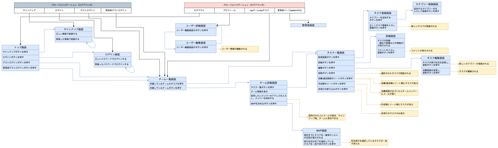

# README

## 開発言語
- Ruby 3.0.1
- Rails 6.1.7

## 就業Termの技術
- devise
- Ajaxを使ったコメント機能
- AWS EC2へのデプロイ

## カリキュラム外の技術
- gem/chartkick
- gem/devise_invitable
- gem/whenever
- gem/cancancan
- gem/rails_admin

## 実行手順
````
$ git clone https://github.com/Asumi8/TOPPA.git
$ cd TOPPA
$ bundle install
$ rails db:create && rails db:migrate
$ rails s
````

## チェックシート
https://docs.google.com/spreadsheets/d/1yeCun6xliH7EAC6EPs_U1IBQXarmhQUshdeRfbPkAaY/edit?usp=sharing

## カタログ設計
https://docs.google.com/spreadsheets/d/1yeCun6xliH7EAC6EPs_U1IBQXarmhQUshdeRfbPkAaY/edit?usp=sharing

## テーブル定義書
https://docs.google.com/spreadsheets/d/1yeCun6xliH7EAC6EPs_U1IBQXarmhQUshdeRfbPkAaY/edit?usp=sharing

## ワイヤーフレーム
https://www.figma.com/file/Srmf7LUgjEvhlCxgRo3E3r/Untitled?node-id=0%3A1&t=W0msj45hUh7XIkCA-1

## ER図


## 画面遷移図

